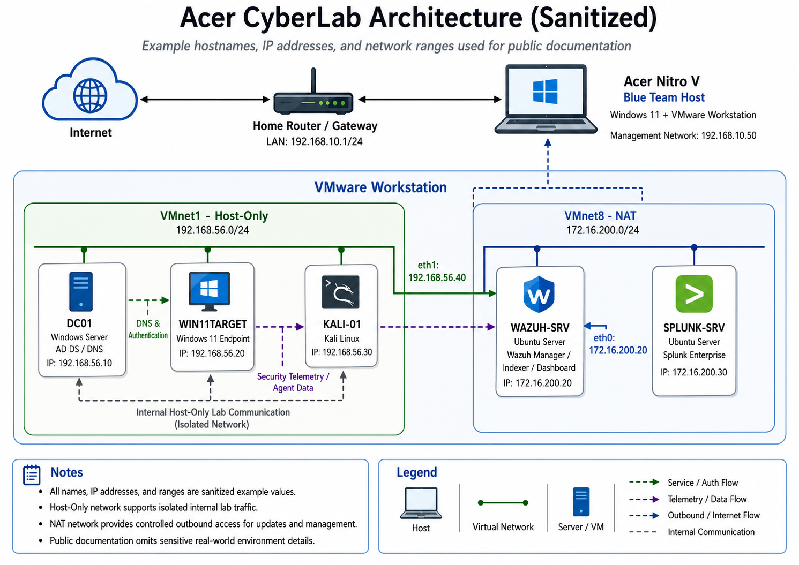
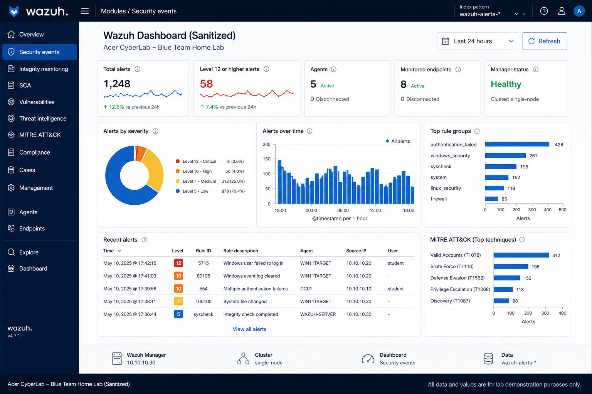
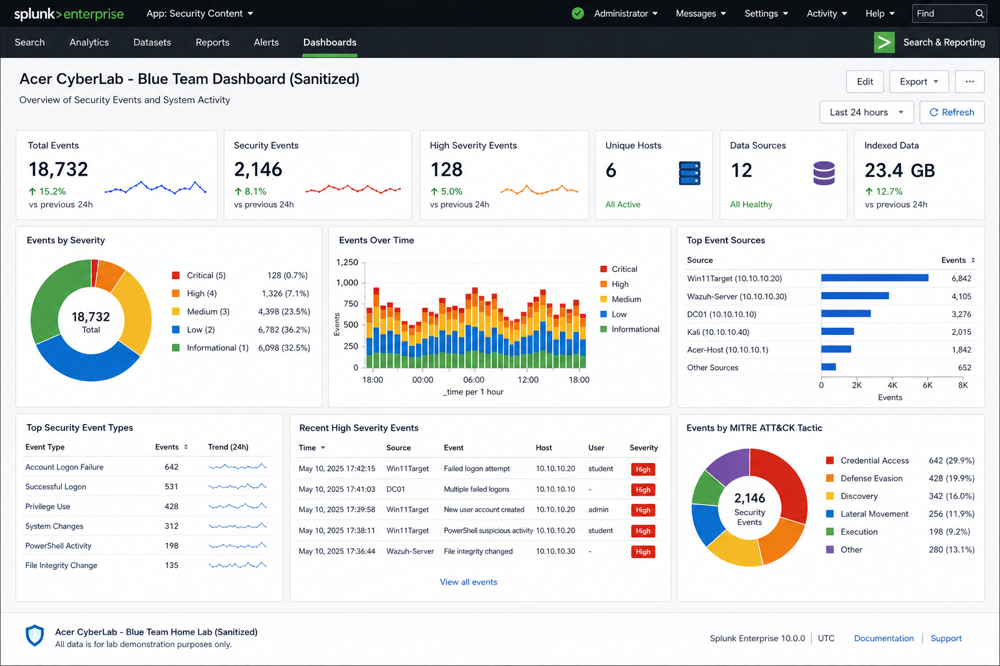
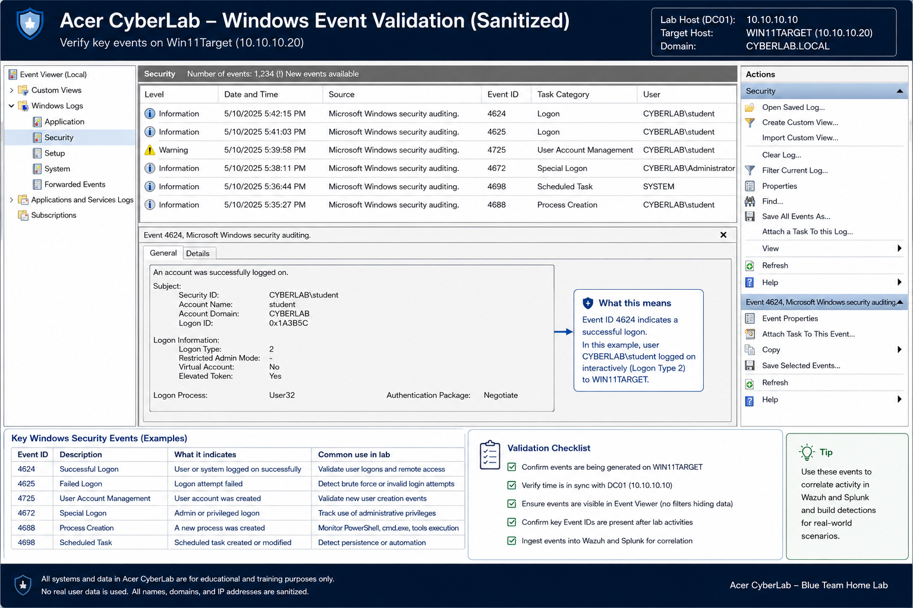
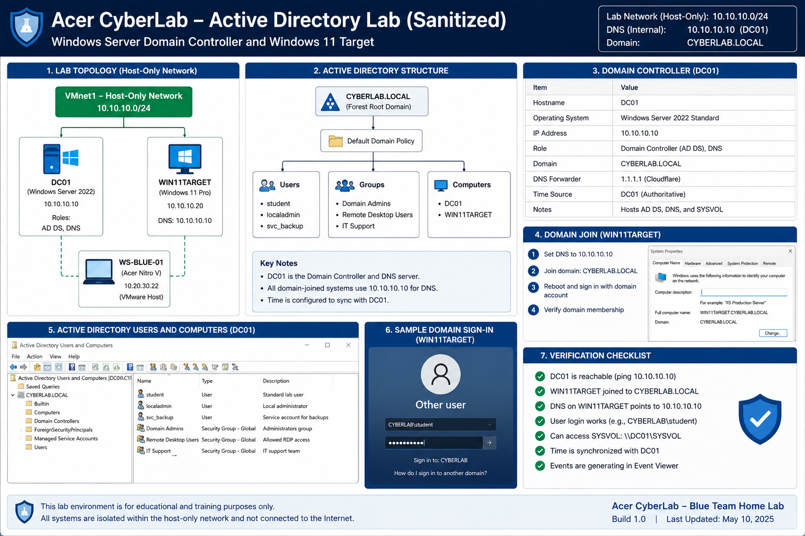
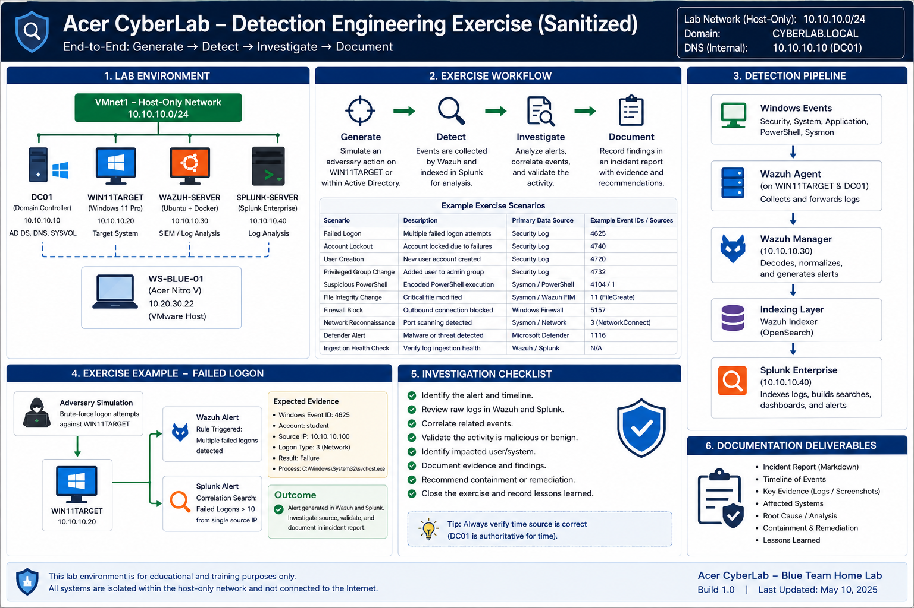

<div align="center">

# Blue Team Detection CyberLab

### Enterprise-Inspired Security Monitoring, Identity, Log Analysis, and Detection Engineering Lab

A modular cybersecurity home lab built with VMware Workstation, Windows Active Directory, Wazuh, Splunk, Kali Linux, and controlled detection-engineering exercises.

<br>

[Project Overview](#project-overview) •
[Architecture](#architecture) •
[Documentation](#documentation) •
[Exercises](#detection-engineering-exercises) •
[Runbooks](#operational-runbooks) •
[Skills Demonstrated](#skills-demonstrated)

</div>

---

## Project Gallery

| CyberLab Architecture (Sanitized)                                                          | Wazuh Security Monitoring (Sanitized)                                                    |
| ------------------------------------------------------------------------------ | ---------------------------------------------------------------------------- |
|  |  |

| Splunk Log Analysis (Sanitized)                                                    | Windows Endpoint Telemetry (Sanitized)                                                             |
| ----------------------------------------------------------------------- | --------------------------------------------------------------------------------------- |
|  |  |

| Active Directory Lab (Sanitized)                                                            | Detection Exercise (Sanitized)                                                         |
| -------------------------------------------------------------------------------- | -------------------------------------------------------------------------- |
|  |  |

---

## Project Overview

The **Blue Team Detection CyberLab** is a privately operated, enterprise-inspired security lab designed to develop practical experience with:

* Active Directory administration
* Windows endpoint monitoring
* Security Information and Event Management
* Centralized log ingestion
* Security-event investigation
* Detection engineering
* MITRE ATT&CK mapping
* Network and identity troubleshooting
* Snapshot and recovery planning
* Technical runbook development
* Public security documentation

The environment is designed as an interconnected defensive system rather than a collection of unrelated security tools.

The lab supports controlled activity generation, endpoint telemetry collection, SIEM analysis, alert validation, evidence preservation, and documented investigation workflows.

---

## Project Highlights

| Capability                  | Implementation                                                |
| --------------------------- | ------------------------------------------------------------- |
| Identity services           | Windows Server Active Directory Domain Services               |
| Internal name resolution    | Active Directory-integrated DNS                               |
| Monitored endpoint          | Domain-joined Windows 11 virtual machine                      |
| Primary security monitoring | Wazuh all-in-one deployment                                   |
| Log analytics               | Splunk Enterprise                                             |
| Testing workstation         | Kali Linux                                                    |
| Virtualization              | VMware Workstation                                            |
| Internal lab network        | VMware host-only networking                                   |
| Controlled internet access  | Temporary VMware NAT adapters                                 |
| Endpoint collection         | Wazuh agent and Splunk Universal Forwarder                    |
| Detection development       | Wazuh rules, Splunk SPL, and controlled exercises             |
| Framework alignment         | MITRE ATT&CK                                                  |
| Recovery                    | VMware snapshots, cold VM backups, and configuration archives |
| Documentation               | GitHub project guides, exercises, and operational runbooks    |

---

## Architecture

The CyberLab uses a host-only VMware network as its primary security boundary.

```
                         Acer Windows Host
                                 |
                         VMware Workstation
                                 |
                      Host-Only CyberLab Network
                                 |
        _________________________|_________________________
       |                         |                         |
     DC01                   WIN11TARGET              KALI-TEST
 Active Directory         Monitored Endpoint      Authorized Testing
       |                         |                         |
       |                    _____|_____                    |
       |                   |           |                   |
       |                Wazuh       Splunk                 |
       |                   |           |                   |
       |                   |___________|                   |
       |                         |                         |
       |_________________________|_________________________|
                                 |
                    Detection and Investigation
```

Temporary NAT adapters may be enabled for:

* Operating system updates
* Package installation
* Repository access
* Software downloads
* Time synchronization

Bridged networking is not used as the default lab configuration.

---

## Architecture Principles

The lab follows several core design principles:

| Principle               | Application                                                               |
| ----------------------- | ------------------------------------------------------------------------- |
| Isolation               | Host-only networking separates lab traffic from the physical home network |
| Least privilege         | Standard users are used for routine activity and testing                  |
| Controlled connectivity | NAT access is enabled only when required                                  |
| Stable infrastructure   | Core systems use predictable internal addressing                          |
| Layered monitoring      | Endpoint, identity, SIEM, and packet-level evidence are compared          |
| Repeatable validation   | Harmless known events are used to test ingestion                          |
| Recoverability          | Snapshots and backups are created before major changes                    |
| Public sanitization     | Operational values are removed from GitHub documentation                  |

---

## Lab Platforms

### Virtualization Layer

* VMware Workstation
* Host-only virtual network
* NAT virtual network
* Powered-off snapshots
* Cold virtual machine backups
* Controlled adapter assignment

### Identity and Endpoint Layer

* Windows Server
* Active Directory Domain Services
* Active Directory-integrated DNS
* Group Policy
* Domain user and administrative account separation
* Domain-joined Windows 11 endpoint
* Windows Event Logs
* Microsoft Defender
* Windows Firewall
* PowerShell logging

### Security Monitoring Layer

* Wazuh manager
* Wazuh indexer
* Wazuh dashboard
* Wazuh endpoint agent
* File integrity monitoring
* Security configuration assessment
* Splunk Enterprise
* Splunk Web
* Splunk indexes
* Splunk Search Processing Language
* Splunk Universal Forwarder

### Testing Layer

* Kali Linux
* Nmap
* Wireshark
* tcpdump
* DNS utilities
* TCP connection testing
* Controlled authentication exercises
* Authorized network-activity generation

---

## Data Flow

```
Authorized Activity
        |
        v
Windows or Linux Event Generation
        |
        v
Local Event Log or File-System Record
        |
        v
Wazuh Agent / Splunk Forwarder
        |
        v
Internal VMware Network
        |
        v
Wazuh / Splunk
        |
        v
Alert, Search, and Timeline Analysis
        |
        v
Documented Investigation
```

Each detection exercise validates the full path rather than checking only whether a dashboard loads.

---

## Detection Engineering

The project uses a repeatable detection-development lifecycle:

```
Define Behavior
      |
      v
Identify Required Telemetry
      |
      v
Generate Authorized Test Activity
      |
      v
Validate the Source Event
      |
      v
Confirm Log Ingestion
      |
      v
Develop or Review Detection Logic
      |
      v
Investigate the Result
      |
      v
Test False Positives
      |
      v
Tune and Document
```

Detection work may include:

* Wazuh prebuilt-rule validation
* Custom Wazuh rule development
* Splunk SPL searches
* Saved searches
* Investigation dashboards
* Authentication-event correlation
* Account-management monitoring
* PowerShell analysis
* File integrity monitoring
* Network reconnaissance visibility
* Ingestion-health validation

---

## Documentation

The project documentation is organized as a structured deployment and operations guide.

| Document                                                                        | Purpose                                                        |
| ------------------------------------------------------------------------------- | -------------------------------------------------------------- |
| 1. [Architecture](docs/01-architecture.md)                                      | Logical design, systems, dependencies, and traffic flow        |
| 2. [Host Configuration](docs/02-host-configuration.md)                          | Acer host preparation and virtualization requirements          |
| 3. [VMware Network Design](docs/03-vmware-network-design.md)                    | Host-only and NAT network architecture                         |
| 4. [Domain Controller Setup](docs/04-domain-controller-setup.md)                | Windows Server, AD DS, DNS, users, groups, and policy          |
| 5. [Windows Endpoint Setup](docs/05-windows-endpoint-setup.md)                  | Windows 11 deployment, domain join, auditing, and monitoring   |
| 6. [Wazuh SIEM Setup](docs/06-wazuh-siem-setup.md)                              | Wazuh deployment, agent enrollment, and event validation       |
| 7. [Splunk Setup](docs/07-splunk-setup.md)                                      | Splunk installation, service startup, forwarding, and searches |
| 8. [Kali Testing System](docs/08-kali-testing-system.md)                        | Authorized activity-generation and testing workstation         |
| 9. [Log Ingestion and Validation](docs/09-log-ingestion-and-validation.md)      | End-to-end telemetry and data-quality validation               |
| 10. [Snapshot and Recovery Strategy](docs/10-snapshot-and-recovery-strategy.md) | Snapshots, backups, restoration, and recovery testing          |
| 11. [Troubleshooting](docs/11-troubleshooting.md)                               | Layered diagnostic and repair framework                        |
| 12. [Security and Sanitization](docs/12-security-and-sanitization.md)           | Isolation, credential protection, and public-release controls  |
| 13. [Lessons Learned](docs/13-lessons-learned.md)                               | Technical findings, improvements, and project assessment       |

---

## Detection Engineering Exercises

Controlled exercises are maintained separately from the deployment documentation.

| Exercise                                                                                  | Primary Objective                                           | Status  |
| ----------------------------------------------------------------------------------------- | ----------------------------------------------------------- | ------- |
| [Detection Engineering Exercise Index](exercises/00-detection-engineering-exercises.md)   | Exercise standards, evidence, validation, and safety        | Active  |
| 1. [Failed Login Investigation](exercises/01-failed-logon-investigation.md)               | Investigate a controlled authentication failure             | Planned |
| 2. [Account Lockout Investigation](exercises/02-account-lockout-investigation.md)         | Correlate failed attempts with account lockout              | Planned |
| 3. [User Account Creation](exercises/03-user-account-creation.md)                         | Detect and investigate a new directory account              | Planned |
| 4. [Privileged Group Change](exercises/04-privileged-group-change.md)                     | Monitor group-membership and privilege changes              | Planned |
| 5. [Suspicious PowerShell](exercises/05-suspicious-powershell.md)                         | Validate PowerShell process and script telemetry            | Planned |
| 6. [File Integrity Change](exercises/06-file-integrity-change.md)                         | Detect controlled file creation, modification, and deletion | Planned |
| 7. [Defender Alert Validation](exercises/07-defender-alert-validation.md)                 | Validate endpoint-protection telemetry                      | Planned |
| 8. [Firewall Block Investigation](exercises/08-firewall-block-investigation.md)           | Investigate a controlled blocked connection                 | Planned |
| 9. [Network Reconnaissance Detection](exercises/09-network-reconnaissance-detection.md)   | Evaluate visibility into a limited authorized scan          | Planned |
| 10. [Ingestion Health Validation](exercises/10-ingestion-health-validation.md)            | Validate the full source-to-SIEM pipeline                   | Planned |

Exercise statuses will be updated as validation work is completed.

---

## Operational Runbooks

Short operational runbooks are planned for repeatable administration and incident handling.

```
runbooks/
├── README.md
├── start-cyberlab.md
├── stop-cyberlab.md
├── vm-unreachable.md
├── dns-resolution-failure.md
├── domain-join-failure.md
├── repair-domain-secure-channel.md
├── wazuh-dashboard-down.md
├── wazuh-agent-disconnected.md
├── splunk-web-down.md
├── splunk-forwarder-not-sending.md
├── missing-security-events.md
├── low-disk-space.md
└── restore-vm-snapshot.md
```

Runbooks are intentionally shorter than the main documentation and focus on:

* Symptoms
* Required access
* Evidence preservation
* Diagnostic steps
* Recovery steps
* Validation
* Rollback
* Escalation conditions

---

## Validation Methodology

A system or service is not considered validated simply because it starts.

The project uses known test events to verify:

* Source event generation
* Local event visibility
* Agent or forwarder operation
* Network transport
* SIEM receipt
* Parsing
* Timestamp accuracy
* Host identity
* Searchability
* Alerting
* Investigation context

Example validation chain:

```
Harmless Test Action
        |
        v
Windows Event Viewer
        |
        v
Wazuh Agent and Splunk Forwarder
        |
        v
Wazuh Alert and Splunk Search
        |
        v
Timeline and Investigation Notes
```

---

## Security Controls

The CyberLab uses the following safeguards:

* Host-only networking by default
* No public port forwarding
* No public SIEM exposure
* Temporary NAT access only when needed
* Separate standard and administrative accounts
* Dedicated test accounts
* Strong unique credentials
* Windows and Linux firewalls
* Limited root and administrative access
* Snapshots before significant changes
* Independent configuration backups
* Sanitized public documentation
* No raw operational logs or packet captures in GitHub

---

## Public Sanitization

This repository intentionally excludes or replaces:

* Operational IP addresses
* Internal domain names
* Personal usernames
* Email addresses
* Passwords
* API tokens
* Session identifiers
* Agent enrollment keys
* Private keys
* License information
* MAC addresses
* VMware identifiers
* Backup locations
* Raw packet captures
* Unsanitized event logs

Documentation-safe examples use reserved values such as:

```
Documentation network: 192.0.2.0/24
Example domain: cyberlab.example
Example endpoint: WIN11TARGET
Example SIEM server: WAZUH-SERVER
```

The repository demonstrates architecture and methodology without publishing direct access information.

---

## Project Status

| Area                       | Status       |
| -------------------------- | ------------ |
| VMware architecture        | Complete     |
| Host-only network          | Complete     |
| Domain controller          | Complete     |
| Active Directory DNS       | Complete     |
| Windows endpoint           | Complete     |
| Domain membership          | Complete     |
| Wazuh deployment           | Complete     |
| Wazuh dashboard access     | Complete     |
| Wazuh agent enrollment     | Complete     |
| Splunk installation        | Complete     |
| Splunk Web validation      | Complete     |
| Kali testing system        | In progress  |
| Splunk forwarder ingestion | Planned      |
| Sysmon deployment          | Planned      |
| Detection exercise library | In progress  |
| Operational runbooks       | Planned      |
| Network IDS telemetry      | Future phase |
| External VM backups        | Planned      |

---

## Current Lab Milestone

The environment currently provides:

* A functioning Active Directory domain
* Internal DNS
* A domain-joined Windows endpoint
* A deployed Wazuh SIEM
* Wazuh dashboard access
* Endpoint monitoring
* A deployed Splunk server
* Splunk Web access
* A controlled Kali testing role
* Documented snapshot milestones
* GitHub-ready sanitized project documentation

The next technical phase focuses on:

* Windows log forwarding to Splunk
* Sysmon deployment
* Known-event ingestion validation
* Authentication detection exercises
* Coverage tracking
* Short operational runbooks

---

## Planned Improvements

Future work includes:

* Deploy Splunk Universal Forwarder
* Migrate Splunk away from root execution
* Install and tune Sysmon
* Add Windows Event Forwarding
* Develop custom Wazuh rules
* Build Splunk saved searches and alerts
* Add Suricata
* Add Zeek
* Create a detection coverage matrix
* Automate lab health checks
* Automate configuration backups
* Complete individual exercise reports
* Build incident-response runbooks
* Test full lab recovery
* Add sanitized screenshots and diagrams

---

## Skills Demonstrated

### Infrastructure

* VMware Workstation
* Virtual network design
* Host-only and NAT networking
* Windows Server
* Windows 11
* Ubuntu Linux
* Kali Linux
* Docker
* Docker Compose

### Identity and Access

* Active Directory
* DNS
* Group Policy
* Domain joining
* User and group administration
* Administrative account separation
* Domain secure-channel troubleshooting

### Security Monitoring

* Wazuh
* Splunk
* Windows Event Logs
* File integrity monitoring
* Security configuration assessment
* Endpoint telemetry
* Log ingestion
* Data-quality validation

### Detection and Investigation

* Splunk SPL
* Wazuh rule analysis
* MITRE ATT&CK mapping
* Authentication-event analysis
* Account-change monitoring
* PowerShell telemetry
* Network reconnaissance analysis
* Timeline reconstruction
* False-positive evaluation

### Operations

* Snapshot management
* Backup planning
* Recovery testing
* Troubleshooting
* Change management
* Evidence preservation
* Runbook development
* Security sanitization

---

## Key Lessons

* Stable infrastructure must come before advanced testing.
* DNS and time are critical security dependencies.
* Host-only networking provides an effective default safety boundary.
* A running service does not guarantee application health.
* A running agent does not guarantee complete telemetry.
* A visible alert does not prove correct detection logic.
* Source events should be validated before troubleshooting the SIEM.
* Missing alerts often reveal valuable telemetry or detection gaps.
* Snapshots are rollback tools, not independent backups.
* Evidence should be exported before restoration.
* Public technical documentation requires a separate security review.
* Documentation is part of the engineering process.

---

## Ethical Use

This project documents a privately owned cybersecurity training environment.

All security testing described in this repository is limited to:

* Systems owned by the operator
* CyberLab virtual machines
* Dedicated test accounts
* Synthetic test data
* Explicitly authorized targets

Nothing in this repository should be interpreted as permission to scan, access, disrupt, or test a third-party system.

---

## Disclaimer

This repository is intended for:

* Defensive security education
* Blue Team practice
* Lab administration
* Detection engineering
* Incident investigation
* Technical portfolio development

Commands and configurations should be reviewed and adapted before use in another environment.

The public examples are sanitized and may not match an operational deployment exactly.

---

<div align="center">

<br>

[Back to Top](#blue-team-detection-cyberlab)

</div>
